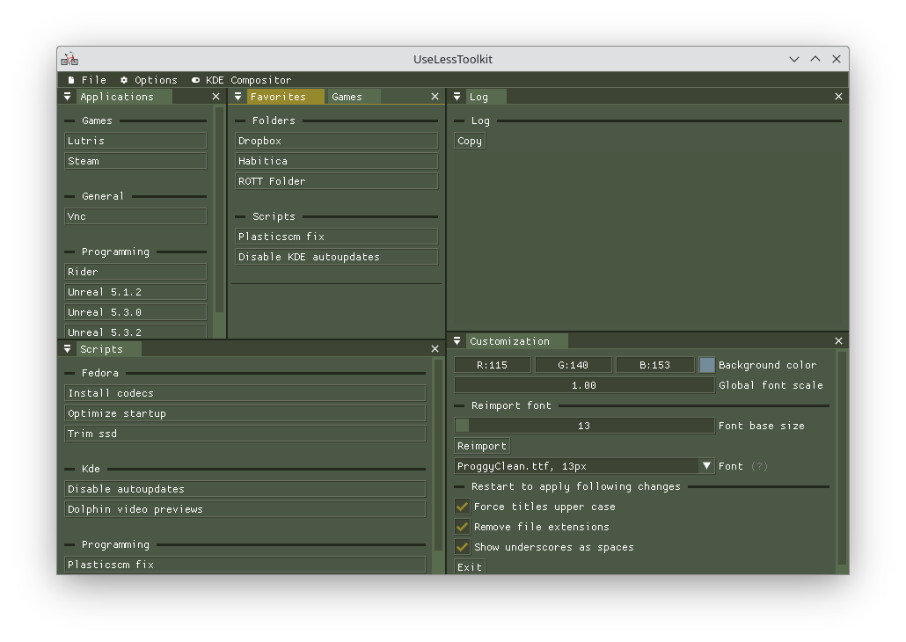

# Use-Less-Toolkit for Linux



**Use-Less-Toolkit** is a configurable UI to launch your favorite scripts, applications and locations, everything on a single useless application for lazy people that does not like writing commands on the terminal (or those ones that tend to forget everything).

Configuration samples are available under *data* folder

## Quick start

### Fedora

1. Install these packages:

   ```bash
   sudo dnf install clang
   sudo dnf install freetype-devel
   sudo dnf install glfw-devel
   ```

2. Install **clangd** extension for VSCode (or VSCodium).

3. Build with **Ctrl + Shift + B** and debug with **F5**.
